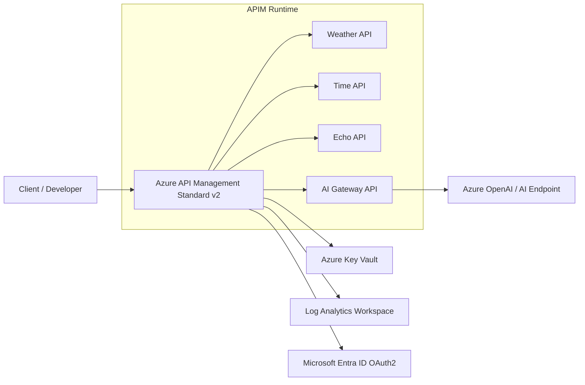

# Azure API Management Terraform Solution

[](https://www.terraform.io/)
[](https://learn.microsoft.com/azure/api-management/)
[](LICENSE)

A Terraform implementation of Azure API Management (APIM) Standard v2 with Azure-native identity, secret management, observability, and sample API routing patterns.

This solution provisions:

- APIM Standard v2 with managed identity
- API surface for weather, time, echo, and AI gateway patterns
- Entra ID OAuth authorization server and APIM Entra identity provider configuration
- AzAPI-managed developer portal sign-in/sign-up settings and published portal revision for non-V2 APIM SKUs
- Key Vault-backed secret flow for APIM named values
- Log Analytics diagnostics for gateway, portal, and audit telemetry
- APIM service RBAC grant for the currently authenticated deployment identity

## Architecture



Detailed design and operational notes: [docs/architecture.md](docs/architecture.md)

## Solution description

The deployment builds a secure API gateway foundation on APIM and wires it to supporting Azure platform services:

1. APIM is deployed using Azure Verified Modules with a managed identity.
2. APIM policies enforce ingress controls and attach operational headers/traces.
3. Secrets are stored in Key Vault and consumed through APIM named values.
4. Diagnostics are shipped to Log Analytics for monitoring and auditability.
5. Product/subscription configuration enables controlled API consumer onboarding.

## Terraform workflow (best-practice aligned)

Prerequisites:

- Azure CLI authenticated with a subscription that can create APIM, Key Vault, Log Analytics, and Cognitive Services resources
- Terraform >= 1.9
- Remote state backend configured for team usage (recommended for shared environments)

```powershell
terraform init
terraform fmt -recursive
terraform validate
terraform plan -out tfplan
terraform apply tfplan
```

Recommended variable handling:

- Keep environment-specific settings in `*.tfvars` files outside source control.
- Pass secrets with environment variables (`TF_VAR_*`) or secure pipeline variables.
- Keep `terraform.tfstate` out of Git (already enforced by `.gitignore`).

## Deployment notes

- Update `allowed_ip_addresses` to include your current public egress IP before deployment.
- Replace placeholder Entra app values (`entra_client_id`, `entra_client_secret`) with real credentials.
- Review APIM policy behavior before exposing publicly.

## Repository layout

- `main.tf` — core resource graph and APIM module composition
- `locals.tf` — API/policy configuration and derived naming
- `variables.tf` — deployment configuration inputs
- `specs/` — OpenAPI definitions imported into APIM
- `scripts/` — PowerShell demo traffic generators for APIM telemetry
- `docs/architecture.md` — architecture and operations details
- `docs/scripts/telemetry-walkthrough.md` — telemetry demo and query walkthrough

## License

This project is licensed under the MIT License. See [LICENSE](LICENSE).
