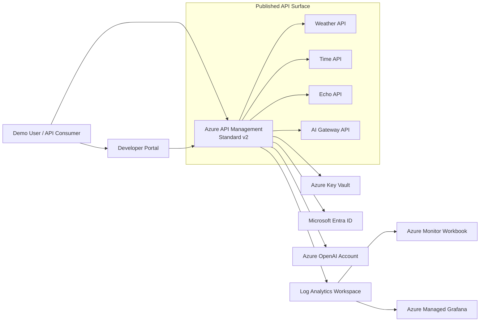
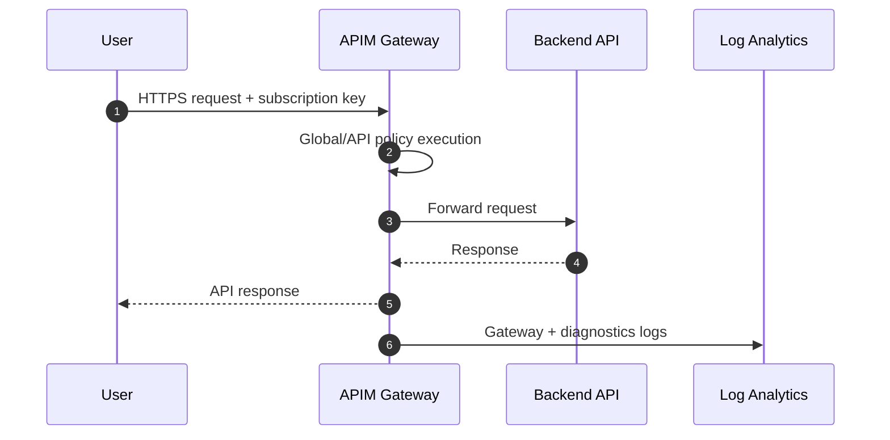

# Azure API Management Terraform Solution

[](https://www.terraform.io/)
[](https://learn.microsoft.com/azure/api-management/)
[](https://registry.terraform.io/providers/Azure/azapi/latest)
[](https://learn.microsoft.com/powershell/)
[](https://mermaid.js.org/)
[](LICENSE)
[](https://github.com/aionic/APIM-Demo)

Opinionated Terraform deployment for **Azure API Management Standard v2** with:
1. **AzAPI-provisioned APIM service** (v2 SKU support)
2. **Entra OAuth** (authorization server + portal identity provider)
3. **Observability** (Log Analytics, Azure Monitor workbook, Azure Managed Grafana)
4. **Demo APIs** (weather/time/echo/llm) and repeatable traffic scripts

## Architecture





Extended architecture notes: [`docs/architecture.md`](docs/architecture.md)

## What gets deployed

1. Resource Group, Key Vault, Log Analytics, OpenAI account
2. APIM Standard v2 (AzAPI) + system-assigned managed identity
3. APIM APIs, products, subscriptions, and policies
4. Entra authorization server and portal identity provider
5. Workbook dashboard + Azure Managed Grafana with managed identity

## Quick start

### Prereqs

- Azure CLI logged in to target subscription
- Terraform `>= 1.9`
- PowerShell 7+

### Configure local environment files

Create a local tfvars file from the example and fill in your Entra values:

```powershell
Copy-Item .\env\demo.tfvars.example .\env\demo.auto.tfvars
```

Required fields:
- `entra_client_id`
- `entra_client_secret`

If you want remote state, copy the backend template too:

```powershell
Copy-Item .\env\backend.azurerm.hcl.example .\env\backend.azurerm.hcl
```

### Deploy

```powershell
terraform init
terraform fmt -recursive
terraform validate
terraform plan -out tfplan
terraform apply tfplan
```

### Optional remote state

```powershell
terraform init -backend-config=.\env\backend.azurerm.hcl
```

### Run demo traffic

```powershell
$GatewayUrl = terraform output -raw apim_gateway_url
$Sub = terraform output -json subscription_keys | ConvertFrom-Json
$Key = $Sub.'demo-subscription'.primary_key

pwsh .\scripts\invoke-apim-smoke.ps1 -GatewayUrl $GatewayUrl -SubscriptionKey $Key
pwsh .\scripts\invoke-apim-telemetry-burst.ps1 -GatewayUrl $GatewayUrl -SubscriptionKey $Key -Iterations 60 -DelayMs 250
```

### OAuth setup

```powershell
pwsh .\scripts\setup-oauth.ps1
terraform apply
```

Developer portal URL:

```powershell
terraform output -raw apim_portal_url
```

## Monitoring

### Azure Monitor workbook
- Portal -> Resource Group -> Workbooks -> **APIM Demo Dashboard**

### Azure Managed Grafana

```powershell
terraform output -raw grafana_url
```

Telemetry walkthrough with KQL examples:  
[`docs/scripts/telemetry-walkthrough.md`](docs/scripts/telemetry-walkthrough.md)

## Demo process

1. Generate or refresh the Entra app values with `pwsh .\scripts\setup-oauth.ps1`.
2. Apply the infrastructure with Terraform.
3. Run the smoke script to confirm weather, time, and echo return `200`.
4. Run the burst script to generate gateway telemetry.
5. Open the workbook and Managed Grafana endpoint from Terraform output.

## Cleanup

```powershell
pwsh .\scripts\teardown.ps1
```

Use `-Force` to skip prompt.

## Repository layout

- `main.tf` - root module composition (platform, apim, observability)
- `locals.tf` - API maps and policy content
- `variables.tf` - configurable inputs
- `env/` - checked-in templates; local `.auto.tfvars` and backend files stay ignored
- `modules/platform/` - core Azure services (RG, LAW, Key Vault, OpenAI)
- `modules/apim/` - APIM service, APIs, products, subscriptions, OAuth, diagnostics
- `modules/observability/` - workbook + Azure Managed Grafana
- `specs/` - OpenAPI documents imported into APIM
- `scripts/` - deploy/demo/teardown helpers
- `docs/` - architecture and telemetry docs

## License

MIT. See [`LICENSE`](LICENSE).
