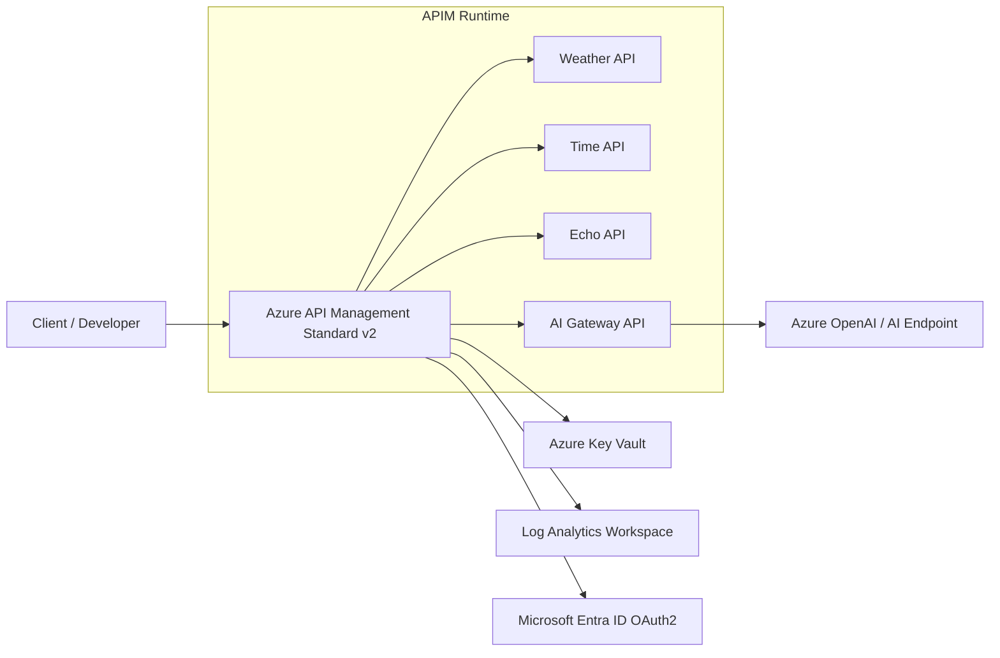

# Azure API Management Terraform Solution

[](https://www.terraform.io/)
[](https://learn.microsoft.com/azure/api-management/)
[](LICENSE)

A Terraform implementation of Azure API Management (APIM) Developer v2 with Azure-native identity, secret management, observability, OAuth flows, and sample API routing patterns.

This solution provisions:

- APIM Developer v2 with managed identity (demo-friendly SKU)
- API surface for weather, time, echo, and AI gateway patterns
- Entra ID OAuth authorization server and APIM Entra identity provider configuration
- Monitoring via Azure Monitor workbooks and Grafana dashboards
- Key Vault-backed secret flow for APIM named values
- Log Analytics diagnostics for gateway, portal, and audit telemetry
- APIM service RBAC grant for the currently authenticated deployment identity

## Architecture



Detailed design and operational notes: [docs/architecture.md](docs/architecture.md)

## Solution description

The deployment builds a secure API gateway foundation on APIM and wires it to supporting Azure platform services:

1. APIM is deployed using Azure Verified Modules with a managed identity.
2. APIM policies enforce ingress controls and attach operational headers/traces.
3. Secrets are stored in Key Vault and consumed through APIM named values.
4. Diagnostics are shipped to Log Analytics for monitoring and auditability.
5. Product/subscription configuration enables controlled API consumer onboarding.

## Terraform workflow (best-practice aligned)

Prerequisites:

- Azure CLI authenticated with a subscription that can create APIM, Key Vault, Log Analytics, and Cognitive Services resources
- Terraform >= 1.9
- Remote state backend configured for team usage (recommended for shared environments)

```powershell
terraform init
terraform fmt -recursive
terraform validate
terraform plan -out tfplan
terraform apply tfplan
```

Recommended variable handling:

- Keep environment-specific settings in `*.tfvars` files outside source control.
- Pass secrets with environment variables (`TF_VAR_*`) or secure pipeline variables.
- Keep `terraform.tfstate` out of Git (already enforced by `.gitignore`).

## Deployment notes

- Update `allowed_ip_addresses` to include your current public egress IP before deployment.
- Entra OAuth app is automatically created via `scripts/setup-oauth.ps1` (see [OAuth Configuration](#oauth-configuration) below).
- Review APIM policy behavior before exposing publicly.

## OAuth Configuration

The solution includes Entra ID OAuth flows for the developer portal. No manual credential entry required—just run the setup script:

```powershell
# Create Entra app registration and update Terraform variables
pwsh .\scripts\setup-oauth.ps1

# Apply infrastructure with OAuth enabled
terraform apply
```

The script:
1. Creates an Entra app registration (`APIM-Demo-OAuth`)
2. Generates a client secret
3. Updates `variables.tf` with the real credentials
4. Configures APIM authorization server and identity provider

**Testing OAuth:** Once deployed, visit the developer portal at the APIM gateway URL and sign in with your Entra ID credentials.

## Monitoring & Observability

Deployments include two monitoring dashboards:

### Azure Monitor Workbook
Native Azure dashboard for APIM metrics—no setup required.
- View at: **Portal → Resource Groups → apim-demo-rg → Workbooks → "APIM Demo Dashboard"**
- Metrics: Request timeline, status code distribution, per-API latency

### Grafana Dashboards
Docker-based Grafana instance connected to Log Analytics for rich visualization.
- Access at: `http://<grafana-container-dns>:3000`
- Grafana admin password: Stored in Key Vault (`grafana-admin-password` secret)
- Default username: `admin`

To retrieve Grafana access details:
```powershell
# Get container DNS name
terraform output grafana_dns

# Get Grafana admin password from Key Vault
az keyvault secret show --vault-name $(terraform output -raw kv_name) --name grafana-admin-password --query value -o tsv
```

Add Log Analytics as a Grafana data source:
- Type: Azure Monitor
- Authentication: Service Principal (use APIM managed identity credentials)
- Subscription ID: `$(az account show --query id -o tsv)`

## Cleanup

When done, tear down all resources to avoid ongoing costs:

```powershell
pwsh .\scripts\teardown.ps1
```

This script will prompt for confirmation before destroying resources. Use `-Force` to skip confirmation.

## Repository layout

- `main.tf` — core resource graph and APIM module composition
- `locals.tf` — API/policy configuration and derived naming
- `variables.tf` — deployment configuration inputs
- `specs/` — OpenAPI definitions imported into APIM
- `monitoring.tf` — Azure Monitor workbook and Grafana container resources
- `scripts/setup-oauth.ps1` — Entra OAuth app registration and credential setup
- `scripts/teardown.ps1` — Safe infrastructure destruction with confirmation
- `scripts/invoke-apim-smoke.ps1` — Three-API smoke test with correlation IDs and timing
- `scripts/invoke-apim-telemetry-burst.ps1` — Load generator (configurable iterations/delays) for telemetry demo
- `docs/scripts/telemetry-walkthrough.md` — telemetry demo and query walkthrough

## License

This project is licensed under the MIT License. See [LICENSE](LICENSE).
