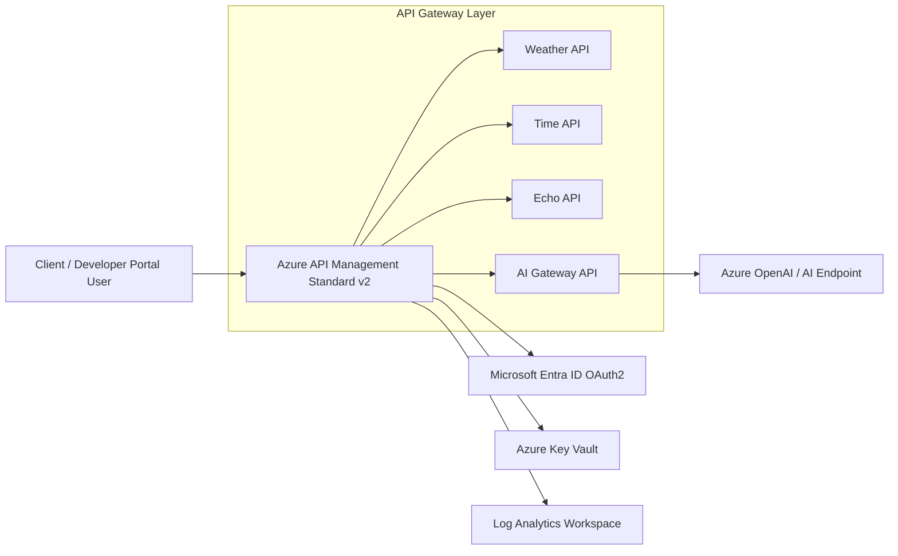

# Architecture

## Solution summary

This repository provisions an Azure API Management platform using Terraform and Azure Verified Modules. APIM Standard v2 serves as the public API gateway and integrates with Entra ID, Key Vault, Log Analytics, and an AI backend endpoint pattern.

## Core topology

## Solution flow

1. Terraform deploys foundational resources: Resource Group, Log Analytics, Key Vault, APIM, and AI endpoint resource.
2. APIM is configured with managed identity, named values, products, subscriptions, and API imports from OpenAPI specs.
3. Inbound policy applies IP allowlisting and correlation/tracing headers before forwarding to backend APIs.
4. Secret-backed values are stored in Key Vault and consumed by APIM policy/runtime configuration.
5. Telemetry and audit logs are sent to Log Analytics for operational monitoring.

## Security and identity

- APIM ingress is restricted with configurable IP allowlist policy.
- OAuth2 authorization server is configured against Microsoft Entra ID.
- Managed identity is used for APIM access to dependent Azure resources.
- Secrets are handled through Key Vault and APIM named values.

## Policy and observability

- Policy snippets implement network controls, header enrichment, and trace signals.
- Diagnostic settings capture APIM gateway and developer portal audit logs.
- Log Analytics is the central sink for runtime and operational telemetry.

## Terraform alignment

- Provider and Terraform versions are constrained in `versions.tf`.
- Resources and policy composition are centralized through locals and AVM module inputs.
- State artifacts are excluded from source control with `.gitignore`.
- Recommended deployment pattern is `plan -out` followed by `apply` on the saved plan.

## Recommended next steps

1. Move Terraform state to a remote backend (Azure Storage) for collaborative deployments.
2. Replace placeholder AI endpoint configuration with your production model deployment.
3. Add alerting/workbooks on top of Log Analytics for operational readiness.
